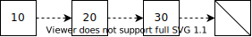
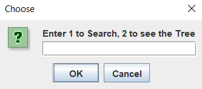

# Details

## Students

|      ID       |        Name        |                Contributions                |
| :-----------: | :----------------: | :-----------------------------------------: |
| 2020A7PS0016U |    Megha Manoj     | Stack-Queue<br />Sorting<br />Binary Search |
| 2020A7PS0198U |    Ahmed Thahir    | Data Generation<br />Hashing<br />Debugging |
| 2020A7PS0221U | Anmol Deepak Kumar |    Trees<br />Documentation<br />Theory     |
| 2020A7PS0224U |   Maaz Chowdhry    |       Trees<br />Tree Search<br />GUI       |

## Title

Sports Database Management System

## Group Name

Algoriteam

## Problem Statement

To implement a Sports Database Management System, using as many concepts from Data Structures and Algorithms as possible.

# Acknowledgement

Firstly, we would like to thank our family and friends, for their constant support throughout out university life.

Moreover, we would like to express our sincere gratitude to the Department of Computer Science, for allowing us to apply our expertise in this assignment, and also for helping us develop the required knowledge to program using the JAVA programming language for this project.

Lastly, our humble and noteworthy appreciation is due to Dr. Pranav Motabhau Pawar for imparting his knowledge. We are thankful his guidance and assistance for the completion of this assignment.

[toc]

# Introduction

## Algorithm

It is a step-by-step procedure to solve a problem in finite time.


### Binary Search

Binary search is a fast search algorithm, that works on the principle of divide and conquer. It requires data in the sorted form.

It looks for a particular item by comparing the middle most item of the collection. If a match occurs, then the index of item is returned. If the middle item is greater than the item, then the item is searched in the sub-array to the left of the middle item. Otherwise, the item is searched for in the sub-array to the right of the middle item. This process continues on the sub-array as well until the size of the subarray reduces to zero.

### Radix Sort

Tuple-based sorting for multi-dimensional element/record.

### Merge Sort

Sorting algorithm that involves the following steps

1. Divide the list
2. Recursively sort the divisions
3. Merge the divisions

### Hashing

Hashing is a process of mapping keys and values into a hash table, using a hash function. The efficiency of mapping depends on the efficiency of the hash function used. It is used for accessing data faster, securing data, crytography, generating unique IDs, etc.

## Complexity

Run-time complexity refers to the amount of time it takes to run an algorithm. The goal of a program is to maximize the best-case scenario and minimize the worst-case scenario.

The worst-case scenario is measured using order of complexity. The most common notation for representing this order of complexity is Big-Oh notation $O$.

Some common orders of complexity are
$$
O(1) < O(\log n) < O(n) < O(n \log n) < O(n^2 \log n) < O(n^2) < \dots < O(2^n), O(e^n)
$$

## Data Structure

It is the organization of data needed to solve the problem.

### Array

It is a linear data-structure, where data is stored **sequentially**.


### Linked List

A linked list is a linear data structure, in which the elements are **not** stored at contiguous memory locations. In other words, a linked list consists of nodes where each node contains a data field and a reference(link) to the next node in the list.



### Stack

Stack is a linear data structure in which the operations are performed in LIFO(Last In First Out) order. The elements are visualized to be stored as ‘on-top’ of each other. They are used in calculator operations, evaluating expressions, and in microprocessors.


### Queue

Queue is a linear data structure in which the operations are performed in FIFO(First In First Out) order. The elements are visualized to be stored as ‘after’ each other. They are used in task scheduling, queuing operations, etc.


### Tree

It is a non-linear hierarchical data structure, where there is a single root node and every other node contains a parent and/or child. Linear data structures like arrays, stacks, queues, and linked list can be traversed in only one way. But a hierarchical data structure like a tree can be traversed in different ways.


## Program

It is the implementation of algorithm in a programming language

This project uses Java programming language for its implementation. Java is a programming language that is used globally to develop various application software.

# Project

## Repository

The code base and this documentation is available on a [Github Repository](https://github.com/AhmedThahir/DSA)

## Flowchart


## Algorithms

### Stack


| Algorithm    | Complexity |
| ------------ | ---------- |
| `isEmpty()`  | $O(1)$     |
| `isFull()`   | $O(1)$     |
| `push(a)`    | $O(1)$     |
| `pop(a)`     | $O(1)$     |
| `display()`  | $O(n)$     |
| `getSize()`  | $O(1)$     |
| `getStack()` | $O(1)$     |

```pseudocode
Algorithm isEmpty():
  if t== -1 Then
      return True
  return False

Algorithm isFull():
  if getSize() == capacity  Then
      return True
  return False

Algorithm push(a):
  INPUT: record a to be inserted into stack
  OUTPUT: stack with newly inserted value and incremented top
  if isFull()  Then
      return "stack full"
  Else
      t= t+1
      stack[t]= a
    
Algorithm pop():

  INPUT: None
  OUTPUT: Deleted record from stack
  initialise temporary record r

  if not isEmpty()  Then
      s= stack[t]
      stack[t]=Null
      t= t- 1
  Return s

Algorithm display():

  if not isEmpty()  Then
      for i=0 to i< getSize() Do
          if stack[i] != Null Then
              stack[i].print()
        
Algorithm getSize():
  Return t + 1 
 
Algorithm getStack():
  Return stack
```

### Queue

| Algorithm      | Complexity |
| -------------- | ---------- |
| `enqueue(rec)` | $O(1)$     |
| `dequeue(rec)` | $O(1)$     |
| `getQ()`       | $O(1)$     |

```pseudocode
Algorithm enqueue(rec):
INPUT: Record rec to be inserted into enqueue stack s1
OUTPUT: Stack s1 with new records
    s1.push(rec)

Algorithm dequeue():
		while !s1.isEmpty() do
			 r1 = s1.pop();
  			 s2.push(r1);

Algorithm getQ():
		 dequeue()
		 Return dequeue stack
```

### Searching

| Algorithm        | Complexity    |
| ---------------- | ------------- |
| `binarySearch()` | $O(\log_2 n)$ |

```pseudocode
Algorithm binarySearch(name):
  INPUT: id to be searched
  OUTPUT: displays whether record has been found

  radixSort()

  id_no= Hash.hash(name) //fetches hash code for name

  stck= getQ()

  records= stck.getStack()

  right= upperbound(records)
  left= lowerbound(records)
  p=0

  While left<=right Do
      mid= (left+right)/2

      id_mid= records[mid].getID()

      if id_mid== id_no then
          p=1
          record found
      Else if id_no> id_mid Do
          left= mid+ 1
      Else 
          right= mid-1

      if p==1 then
          display record
      Else 
          display name+ " not found"
```

### Sorting

| Algorithm              | Complexity      |
| ---------------------- | --------------- |
| `getMax(records, len)` | $O(n)$          |
| Merge Sort             | $O(n \log_2 n)$ |

```pseudocode
Algorithm radixSort():
  INPUT: Unsorted Stack
  OUTPUT: Sorted Stack

  stck= getQ()
  records= getStack()

  len= stck.getSize()
  max= getMax(records, len)

  for e=1 till max/e>0 Do
      sort(records, lowerbound(records) , upperbound(records))
      e*=10


 Algorithm merge(arr, l ,m ,r):

  n1=  = m - l + 1
  n2 = r - m

  initialise array L of length n1

  initialise array R of length n2

  for i=0 to i<n1 Do
      L[i]= arr[l + i]
      i= i+1

  for j=0 to j<n2 Do
      L[j]= arr[1 + m+ j]
      j= j+1

  i=0
  j=0
  k=l 

  While i < n1 && j < n2 Do
      if L[i].getID() <= L[j].getID() Then
          arr[k] = L[i]
          i= i+1 
      Else
          arr[k] = R[j]
          j= j+1 
      k= k+ 1 

  While i< n1 Do
      arr[k] = L[i]
      i = i + 1 
      k= k + 1 


  While j< n2 Do
      arr[k] = R[j]
      j = j + 1 
      k= k + 1 


Algorithm sort(arr, l ,r):
  INPUT: Array arr to be sorted with its upper and lowerbounds
  OUTPUT: sorted array arr
  if l< r then 
      m= l + (r-l)/ 2
      sort(arr, l, m)
      sort(arr, m + 1, r)
      merge(arr, l, m, r)


Algorithm getMax(r, len):
  INPUT: Array r of length len
  OUTPUT: Maximum value present in array r based on ID number

  max= r[0].getID()

  for i=1 to i< len Do
      if max< r[i].getID() Then
          max= r[i].getID()
  Return max
```

### Hashing

| Algorithm | Complexity |
| --------- | ---------- |
| `hash()`  | $O(n)$     |

```pseudocode
Algorithm hash()
	INPUT name
	OUTPUT hashed sum
	
  sum <- 0

  toTitleCase(name) // ensure case-insensitivity

	a <- 10
  for i<-0 to name->length
	  sum += Math.pow(a, i) * name.charAt(i) // a^n * char

  return sum
```

### Tree

| Algorithm                     | Complexity                                                   |
| ----------------------------- | ------------------------------------------------------------ |
| `search(t, str)`              | $O(1)$, as the number of categories will be finite<br />(no more than 10 or so) |
| `traverse(t, str, root, out)` | $O(n)$                                                       |
| `join(m, t)`                  | $O(1)$                                                       |

Time complexity of the tree increases as the height $h$ of the tree increases - $O(h)$. So, to reduce the worst-case complexity of the program for the given number of vertices (entered by user), tree must structured in a way that the height is minimum - ensuring that $O(h)$ can be the least. 

```pseudocode
Algorithm Search(t,str)
	if(str=t.s)
		return t
	c <- 0
	while(t.child[c]!=null)
		x <- Search(t.child[c],str)
		if(x=null IS NOT TRUE)
			return x
		c<-c+1
	return null

	
Algorithm traverse(t, str, root, out)
	if(t=root IS NOT TRUE)
			if(t.p=10)
				out<-out+"\n"+ str+"├──"+t.s
			else
				out<-out+"\n"+ str+"└──"+t.s
			if(t.p=10)
				str<-str+("│  ")
			else 
				str<- str+("   ")
	else
		out<-t.s
	c <- 0
	while(t.child[c]=null IS NOT TRUE)
		out<- traverse(t.child[c],str,root,out)
		c<-c+1
	return out

Algorithm join(m, t)
	if(m.x > -1)
		m.child[m.x].p<-10
	m.x<-m.x+1
	m.child[m.x]<-new Tree(t);
	if(m.x=0)
		m.child[m.x].p<-0
	else
		m.child[m.x].p<-1


Algorithm main()
	in <- "data.csv"
	sc = new Scanner(new File(in))
	Root <- new Tree("Football")
	
	while(sc.hasNext())
		line <- sc.nextLine()
		line <- line.toLowerCase().replaceAll(" ","")
		i2 <- line.lastIndexOf(',')
		r <- line.substring(0,i2)
		t <- line.substring(i2+1)
		if(Search(Root,t)=null)
			join(Root,t)

		m <- Search(Root,t)
		i1 <- r.lastIndexOf(',')
		u <- r.substring(0,i1)
		v <- r.substring(i1+1)
		if(Search(Root,v)=null)
			join(m,v)

		i <- u.indexOf(',')
		u<-u.substring(0,i)
		z <- m.child[m.x]
		join(z,u)
	
	output <- traverse(Root,"",Root,"")
	Display output

	Display ("Enter Role/Position to be searched")
	ACCEPT r
	if(Search(Root,r)=null)
		Display("Not Found!")
	else 
		tr <- Search(Root,r)
		if(tr.child[0]=null)
			Display(r+" is a name!")
		else if(tr=Root)
			Display (r+" is the root!")
		else
			output <- traverse(tr,"",tr,"")
			Display (output)
```

## Source Code

```java
package Code; // This program is in a subfolder

import java.io.File;
import java.io.FileNotFoundException;
import java.util.Scanner;
import java.util.StringTokenizer;

import javax.swing.*;
import java.awt.event.*;
import java.awt.*;

class Hash {
	public static int hash(String name) {
		// polynomial hashing
		int sum = 0;

		name = name.toLowerCase(); // ensure case-insensitivity

		int a = 10;
		for (int i = 0; i < name.length(); i++) {
			sum += Math.pow(a, i) * name.charAt(i); // a^n * char
		}

		return sum;
	}

}

class Case {
	public static String toTitleCase(String text) {
		if (text == null || text.isEmpty()) {
			return text;
		}

		StringBuilder converted = new StringBuilder();

		boolean convertNext = true;
		for (char ch : text.toCharArray()) {
			if (Character.isSpaceChar(ch)) {
				convertNext = true;
			} else if (convertNext) {
				ch = Character.toTitleCase(ch);
				convertNext = false;
			} else {
				ch = Character.toLowerCase(ch);
			}
			converted.append(ch);
		}

		return converted.toString();
	}
}

class Record { // STORE RECORDS
	int id;
	String name;
	int age;
	String role;
	String position;

	public Record(String rec) {
		StringTokenizer st = new StringTokenizer(rec, ",");

		name = st.nextToken();
		name = Case.toTitleCase(name);

		id = Hash.hash(name);
		age = Integer.parseInt(st.nextToken());

		position = st.nextToken();
		position = Case.toTitleCase(position);
		
		role = st.nextToken();
		role = Case.toTitleCase(role);
	}

	public Record() {
	}

	void print() { // PRINT RECORD DETAILS
		JOptionPane.showMessageDialog(null,
				"Id: " + id + "\n" +
						"Name: " + name + "\n" +
						"Age: " + age + "\n" +
						"Role: " + role + "\n" +
						"Position: " + position,
				"Output", 3);
	}

	int getID() {
		return id;
	}

	String getName() {
		return name;
	}

	int getAge() {
		return age;
	}

	String getRole() {
		return role;
	}

	String getPos() {
		return position;
	}

}

class Queue {

	int last = 0;
	int capacity = 1000; // TOTAL CAPACITY OF STACK
	static Stack s1; // ENQ STACK
	static Stack s2; // DEQ STACK

	class Stack // SUBCLASS STACK FOR CREATING STACK OBJECTS
	{
		int t = -1;

		Record[] stack;

		public Stack() { // INITIALISES STACK WITH MENTIONED DEFAULT CAPACITY
			stack = new Record[capacity];
		}

		boolean isEmpty() {
			if (t == -1)
				return true;
			return false;
		}

		boolean isFull() {
			if (getSize() == capacity) {
				return true;
			}
			return false;
		}

		void push(Record a) {

			if (isFull())
				JOptionPane.showMessageDialog(null, "Stack Full", "Error", 3);
			else {

				t = t + 1;
				stack[t] = a;
			}

		}

		Record pop() { // POP FROM STACK
			Record s = new Record();

			if (!isEmpty()) {
				s = stack[t];
				stack[t] = null;
				t = t - 1;
			}

			return s;
		}

		void display() { // DISPLAYS RECORDS PRESENT IN STACK
			if (!isEmpty()) {
				for (int i = 0; i < getSize(); i++) {
					if (stack[i] != null)
						stack[i].print();

				}

			}
		}

		Record[] getStack() {
			return stack;
		} // RETURNS THE STACK ARRAY

		int getSize() {
			return t + 1;
		} // SIZE OF THE STACK(GETS UPDATED)
	}

	public Queue() { // INITIALIZES 2 STACKS- ONE FOR ENQUEUE AND ONE FOR DEQUEUE

		s1 = new Stack();
		s2 = new Stack();
	}

	void enqueue(Record rec) {
		s1.push(rec); // CREATING ENQUEUE STACK
	}

	void dequeue() {
		while (!s1.isEmpty()) { // CREATING DEQUEUE STACK
			Record r1 = s1.pop();
			s2.push(r1);
		}
	}

	Stack getQ() { // DEQUEUES THE ENQ STACK, S1, INTO S2 AND RETURNS S2
		dequeue();
		return s2;

	}

	void binSearch(String name) { // SEARCHES BASED ON ID
		radixSort();

		int id_no = Hash.hash(name);

		Stack stck = getQ(); // FETCHES DEQUEUE STACK OBJECT
		Record[] records = stck.getStack(); // FETCHES STACK ARRAY FOR SEARCHING

		int r = stck.getSize() - 1;
		int l = 0;
		int p = 0;

		Record rex = new Record(); // EMPTY RECORD FOR ASSIGNING FOUND RECORD

		while (l <= r) {
			int mid = (l + r) / 2;

			int id_mid = records[mid].getID();

			if (id_mid == id_no) {
				rex = records[mid];
				p = 1;
				break;
			}

			else if (id_mid < id_no) { // this was >
				l = mid + 1;
			}

			else {
				r = mid - 1;
			}

		}

		if (p == 1) {
			rex.print();
		} else {
			JOptionPane.showMessageDialog(null, name + " not found", "Output", 3);
		}
	}

	void radixSort() {
		Stack stck = getQ(); // FETCHES DEQUEUE STACK OBJECT

		Record[] records = stck.getStack(); // FETCHES STACK ARRAY FOR SEARCHING

		int len = stck.getSize(); // FETCHES THE SIZE OF THE STACK
		int max = getMax(records, len);

		for (int e = 1; max / e > 0; e *= 10) {
			sort(records, 0, len - 1);
		}
	}

	void merge(Record arr[], int l, int m, int r) {
		// Find sizes of two subarrays to be merged
		int n1 = m - l + 1;
		int n2 = r - m;

		/* Create temp arrays */
		Record L[] = new Record[n1];
		Record R[] = new Record[n2];

		/* Copy data to temp arrays */
		for (int i = 0; i < n1; ++i)
			L[i] = arr[l + i];
		for (int j = 0; j < n2; ++j)
			R[j] = arr[m + 1 + j];

		/* Merge the temp arrays */

		// Initial indexes of first and second subarrays
		int i = 0, j = 0;

		// Initial index of merged subarray array
		int k = l;
		while (i < n1 && j < n2) {
			if (L[i].getID() <= R[j].getID()) {
				arr[k] = L[i];
				i++;
			} else {
				arr[k] = R[j];
				j++;
			}
			k++;
		}

		/* Copy remaining elements of L[] if any */
		while (i < n1) {
			arr[k] = L[i];
			i++;
			k++;
		}

		/* Copy remaining elements of R[] if any */
		while (j < n2) {
			arr[k] = R[j];
			j++;
			k++;
		}
	}

	void sort(Record arr[], int l, int r) {
		if (l < r) {
			// Find the middle point
			int m = l + (r - l) / 2;

			// Sort first and second halves
			sort(arr, l, m);
			sort(arr, m + 1, r);

			// Merge the sorted halves
			merge(arr, l, m, r);
		}
	}

	int getMax(Record[] r, int len) {
		int max = r[0].getID();

		for (int i = 1; i < len; i++) {
			if (max < r[i].getID()) {
				max = r[i].getID();
			}
		}
		return max;
	}

}

class Tree {
	Tree child[] = new Tree[100];
	int x = -1;
	String s;
	int p;

	Tree(String str) {
		s = Case.toTitleCase(str);
	}

	static Tree Search(Tree t, String str) {
		if (str.equalsIgnoreCase(t.s))
			return t;
		int c = 0;
		while (t.child[c] != null) {
			Tree x = Search(t.child[c], str);
			if (x != null)
				return x;
			c++;
		}
		return null;
	}

	static String traverse(Tree t, String str, Tree root, String out) {
		if (t != root) {
			if (t.p == 10)
				out = out + "\n" + str + "├──" + t.s;
			else
				out = out + "\n" + str + "└──" + t.s;
			if ((t.p == 10)) {
				str = str + ("│  ");
			} else {
				str = str + ("   ");
			}
		} else {
			out = t.s;
		}
		int c = 0;
		while (t.child[c] != null) {
			out = traverse(t.child[c], str, root, out);
			c++;
		}
		return out;
	}

	static void join(Tree m, String t) {
		if (m.x > -1) {
			m.child[m.x].p = 10;
		}
		m.x++;
		m.child[m.x] = new Tree(t);
		if (m.x == 0)
			m.child[m.x].p = 0;
		else
			m.child[m.x].p = 1;
	}

	public static void main() throws FileNotFoundException {
		String in = "data.csv";
		Scanner sc = new Scanner(new File(in));
		Tree Root = new Tree("Football");

		while (sc.hasNext()) {
			String line = sc.nextLine();
			int i2 = line.lastIndexOf(',');
			String r = Case.toTitleCase(
					line.substring(0, i2));
			String t = Case.toTitleCase(
					line.substring(i2 + 1));
			if (Search(Root, t) == null) {
				join(Root, t);
			}
			Tree m = Search(Root, t);
			int i1 = r.lastIndexOf(',');
			String u = r.substring(0, i1);
			String v = r.substring(i1 + 1);
			if (Search(Root, v) == null) {
				join(m, v);
			}
			int i = u.indexOf(',');
			u = u.substring(0, i);
			Tree z = m.child[m.x];
			join(z, u);
		}
		String output = traverse(Root, "", Root, "");
		System.out.println(output);
		System.out.println();
		System.out.println();
		System.out.println();

		String r = JOptionPane.showInputDialog(null, "Enter Role/Position to be searched", "Tree Search", 3).trim();
		if (Search(Root, r) == null)
			JOptionPane.showMessageDialog(null, "Not Found!", "Error", 3);
		else {
			Tree tr = Search(Root, r);
			if (tr.child[0] == null)
				System.out.println(r + " is a name! Invalid Option");
			else if (tr == Root)
				System.out.println(r + " is the root! Invalid Option");
			else {
				output = traverse(tr, "", tr, "");
				System.out.println(output);
			}
		}

	}
}

public class dsa extends Frame implements ActionListener, WindowListener {
	static Scanner s = new Scanner(System.in);
	static File f = new File("data.csv");
	static Scanner sc;
	static Queue q = new Queue(); // 1st stack

	public static void clearScreen() {
		System.out.print("\033[H\033[2J");
		System.out.flush();
	}

	public static void input() throws FileNotFoundException {
		sc = new Scanner(f, "utf-8");
		while (sc.hasNextLine()) {

			String line = sc.nextLine();

			Record recn = new Record(line);
			q.enqueue(recn); // INSERTS RECORDS INTO STACK S1
		}
		sc.close();
	}

	public static void menu() {
		String response1 = JOptionPane.showInputDialog(null, "Name to be searched (Case-Insensitive)", "Binary Search", 3);
		String name = response1;
		q.binSearch(name);
		menu();

	}

	public static void main(String[] args) {
		try {
			String in = JOptionPane.showInputDialog(null, "Enter 1 to Search, 2 to see the Tree", "Choose", 3);
			char c = in.charAt(0);
			switch (c) {
				case '1': {
					input();
					menu();
					break;
				}
				case '2': {
					Tree.main();
					break;
				}

				default: {
					break;
				}

			}

		} catch (Exception e) {
			e.printStackTrace();
		}
	}

	/* ActionEvent handler */
	@Override
	public void actionPerformed(ActionEvent evt) {
	}

	/* WindowEvent handlers */
	// Called back upon clicking close-window button
	@Override
	public void windowClosing(WindowEvent evt) {
		System.exit(0);
	}

	@Override
	public void windowOpened(WindowEvent evt) {
	}

	@Override
	public void windowClosed(WindowEvent evt) {
	}

	@Override
	public void windowIconified(WindowEvent evt) {
	}

	@Override
	public void windowDeiconified(WindowEvent evt) {
	}

	@Override
	public void windowActivated(WindowEvent evt) {
	}

	@Override
	public void windowDeactivated(WindowEvent evt) {
	}
}
```

## Input

The input data is in `data.csv`

```
loki,46,keeper,player
thor,32,coach,staff
superman,34,forward,staff
batman,25,keeper,player
spiderman,46,manager,staff
megha,62,keeper,player
manoj,37,assistant manager,staff
ahmed,44,assistant manager,staff
thahir,30,keeper,player
anmol,60,keeper,player
deepak,50,coach,staff
kumar,38,midfielder,player
maaz,53,defender,player
chowdury,44,midfielder,player
ahamed,35,keeper,player
jameel,56,assistant manager,staff
pranav,46,assistant manager,staff
pawar,61,coach,staff
sujala,33,coach,staff
shetty,30,coach,staff
vijaykumar,40,assistant manager,staff
raj,44,coach,staff
shyam,27,assistant manager,staff
abirami,59,coach,staff
donald,49,forward,staff
azhar,32,keeper,player
rohit,61,defender,player
ishan,55,coach,staff
anurag,41,keeper,player
bharat,40,midfielder,player
krishen,31,forward,staff
shiven,44,defender,player
```

## Output



### Search


### Tree

```
Football
├──Staff
│  ├──Coach
│  │  ├──Loki
│  │  ├──Thor
│  │  ├──Superman      
│  │  └──Megha
│  ├──Assistant Manager
│  │  ├──Manoj
│  │  └──Ahmed
│  └──Manager
│     ├──Thahir        
│     ├──Kumar
│     ├──Chowdury      
│     ├──Pranav        
│     ├──Sujala
│     ├──Vijaykumar
│     ├──Raj
│     └──Bharat
└──Player
   ├──Defender
   │  └──Batman
   ├──Forward
   │  ├──Spiderman
   │  └──Anmol
   ├──Keeper
   │  ├──Deepak
   │  ├──Maaz
   │  ├──Ahamed
   │  └──Jameel
   └──Midfielder
      ├──Pawar
      ├──Shetty
      ├──Shyam
      ├──Abirami
      ├──Donald
      ├──Azhar
      ├──Rohit
      ├──Ishan
      ├──Anurag
      ├──Krishen
      └──Shiven
```


```
Midfielder
├──Pawar
├──Shetty
├──Shyam
├──Abirami
├──Donald
├──Azhar
├──Rohit
├──Ishan
├──Anurag
├──Krishen
└──Shiven
```

# Conclusion

Using JAVA we were able to connect and apply the knowledge we learned in Data Structures and Algorithms. We learned that programming can be used to solve real life problems.

During this assignment, a new concept we learned was that we could use the gui and using various data structures to make a database portal. Our project provides a very efficient service to the users, and its system is well-planned and organized for anyone to run it smoothly. This system can be used to store and access players details. Overall, this was an excellent application activity and benefit to our learning experience.

We have built this project with the skill and knowledge of the following concepts.

## DSA

- [x] Arrays
- [x] Stacks
- [x] Queues
- [x] Hashing - Polynomial
- [x] Sorting - Radix Sort
- [x] Sorting - Merge Sort
- [x] Searching - Binary Search
- [x] Trees
- [x] Linked List (Tree Implementation)
- [x] Searching - Binary Tree Search

## Miscelaneous

- [x] Classes
- [x] Objects
- [x] File Handling
- [x] Exceptions and Exception Handling
- [x] GUI

# References

- “Arrays.binarySearch() in Java with examples | Set 1,” *GeeksforGeeks*, Nov. 12, 2016. https://www.geeksforgeeks.org/arrays-binarysearch-java-examples-set-1/ (accessed Apr. 23, 2022).
- “Binary Trees,” *GeeksforGeeks*. https://www.geeksforgeeks.org/data-structure-gq/binary-trees-gq/ (accessed Apr. 26, 2022).
- “Hashing Data Structure,” *GeeksforGeeks*. https://www.geeksforgeeks.org/hashing-data-structure/ (accessed Apr. 23, 2022).
- “Merge Sort,” *GeeksforGeeks*, Mar. 15, 2013. https://www.geeksforgeeks.org/merge-sort/ (accessed Apr. 22, 2022).
- “Radix Sort,” *GeeksforGeeks*, Sep. 02, 2013. https://www.geeksforgeeks.org/radix-sort/ (accessed Apr. 22, 2022).
- “Java Documentation,” *Oracle Help Center*. https://docs.oracle.com/en/java/ (accessed Apr. 15, 2022).
- “Java Tutorial.” https://www.w3schools.com/java/default.asp (accessed Apr. 15, 2022).
- “Java Documentation - Get Started.” https://docs.oracle.com/en/java/ (accessed Apr. 15, 2022).
- “Java Programming Language,” *GeeksforGeeks*. https://www.geeksforgeeks.org/java/ (accessed Apr. 15, 2022).
- “Queue Data Structure,” *GeeksforGeeks*. https://www.geeksforgeeks.org/queue-data-structure/ (accessed Apr. 20, 2022).
- “Stack Data Structure,” *GeeksforGeeks*. https://www.geeksforgeeks.org/stack-data-structure/ (accessed Apr. 20, 2022).
